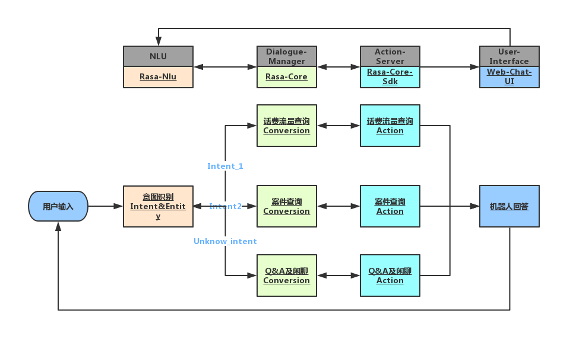

# Rasa Core and Rasa NLU

## Introduction
这个聊天机器人demo是用开源NLU框架[rasa-nlu](https://github.com/RasaHQ/rasa_nlu)完成意图识别与实体识别，用[rasa-core](https://github.com/RasaHQ/rasa_core)完成对话管理和与对话生成。
* 本demo完成的对话主要有:
>  * 1: 办理套餐、查询话费和流量(会话场景1)
>  * 2：案件查询(会话场景2)
>  * 3：Q&A问答+闲聊(合并在unknow_intent的场景里)

* 本demo实现流程
>  

* demo主要参考了
>  * [rasa_chatbot_cn](https://github.com/GaoQ1/rasa_chatbot_cn/)
>  * [_rasa_chatbot](https://github.com/zqhZY/_rasa_chatbot)
>  * [WeatherBot](https://github.com/howl-anderson/WeatherBot)
* 主要包版本
```
python:        3.6.8
rasa-nlu:      0.14.4
rasa-core:     0.13.2
rasa-core-sdk: 0.12.1
tensorflow     1.12.0
keras          2.2.4
```
* 主要文件描述
>  * data/rasa_dataset_training.json ：nlu训练数据
>  * configs/_config.yml 类文件：模型流程定义(language、pipeline等)。nlu_model_config.yml中的pipeline可自定义，这里由于数据量较少，用了开源的方法和词向量(total_word_feature_extractor.dat)。如果你的rasa_dataset_training.json上数据足够多，可以尝试使用nlu_embedding_config.yml(本demo使用)配置来训练nlu model.
>  * mobile_domain.yml ：各组件、动作的定义集合,其实就是特征
>  * endpoint.yml 服务地址、会话存储地址(url)
>  * data/mobile_edit_story.md ：定义各种对话场景,会话流训练数据
>  * bot.py :各种训练nul与 dialogue的方法
>  * actions.py :负责执行自定义 Action (通常都是具体的业务动作，在本项目中通信业务查询、案件查询、闲聊或Q&A)
>  * data/total_word_feature_extractor.dat : 一个训练好的中文特征数据(使用nlu_moel_config.yml配置训练时会用到)
>  * data/news_12g_baidubaike_20g_novel_90g_embedding_64.bin ：训练好的word2vec模型(train_nlu_wordvector：wordvector_config.yml中用到),可下载更大的训练好的模型，下载地址：[连接](https://pan.baidu.com/s/1ckkH_eT-WS4SN73Iq9Q_5A ) 密码：9aza 

* 环境搭建：详见连接[Rasa聊天机器人（一）:简介及环境搭建](https://blog.csdn.net/qq_42189083/article/details/88310407)
## Command
### train nlu model 训练NLU模型(可选择其他的，如train-nlu-wordvector)
```
python bot.py train-nlu
```

### test nlu model 测试NLU模型，主要是看意图是否识别准确，是否抽取到实体
```
python -m rasa_nlu.server --path models/nlu   启动NUL模型服务

curl -XPOST 192.168.109.232:5000/parse -d '{"q":"我要查昨天下午的抢劫案", "project": "default", "model": "current"}'   
```


### train dialogue 训练会话流程(可选择其他的，如train-nlu-transformer)
```
python bot.py train-dialogue-keras
```

### test dialogue     -client端测试对话流程(开启core client服务)
```
python -m rasa_core_sdk.endpoint --actions actions &

python -m rasa_core.run --nlu default/current --core models/dialogue_keras --endpoints endpoints.yml     

```

### dialogue 交互式训练生成新的story(相当于自己构造对话场景数据。新的story可以append到之前训练使用的story中重新训练，重复此过程)
```
python -m rasa_core.train interactive -o models/dialogue_keras -d mobile_domain.yml -s data/mobile_edit_story.md --endpoints endpoints.yml  重头开始训练story，零启动
python -m rasa_core.train interactive --core models/dialogue_keras  --nlu default/current --endpoints endpoints.yml  通过已有story模型训练(构造更多的story,一般用这种方法)
```

### provide dialogue service    -Service端：提供对话服务接口(channel(如web)接入时开启此服务)
```
python -m rasa_core_sdk.endpoint --actions actions &

python -m rasa_core.run --nlu default/current --core models/dialogue_keras --credentials credentials.yml --endpoints endpoints.yml  开启core服务(Service) 
```

### compare policy
```
python -m rasa_core.train compare -c keras_policy.yml embed_policy.yml -d mobile_domain.yml -s data/mobile_edit_story.md -o comparison_models/ --runs 3 --percentages 0 25 50 70
```

### evaluate policy
```
python -m rasa_core.evaluate compare -s data/mobile_edit_story.md --core comparison_models/ -o comparison_results/
```

## Some tips
### 批量生产nlu训练数据
训练数据的构造是非常费时的一件事，本demo data/rasa_dataset_training.json 是通过一些规则自动生成的，节省很多人力。
>  * 工具地址[here](https://rodrigopivi.github.io/Chatito/),
>  * 具体用法可参考[chatito_gen_nlu_data](https://github.com/GaoQ1/chatito_gen_nlu_data)中的使用文档。
>  * 标注语料可参考标注工具[rasa-nlu-trainer](https://rasahq.github.io/rasa-nlu-trainer/)

### UI界面接入
UI界面接入可参考 https://github.com/howl-anderson/WeatherBot_UI 直接更改相应的端口或ip即可使用。
* 启动方法：
>  * 1、启动NLU服务
>  * 2、启动dialogue service 
>  * 3、启动web服务

### 多看官方文档 [rasa_nlu](https://rasa.com/docs/nlu/)、[rasa_core](https://rasa.com/docs/core/) 
其中也有些坑，使用期间有任何问题，欢迎随时issue！


## Q&A
###  ner_duckling 无法使用
从rasa_nlu=0.14.0 开始就不使用ner_duckling，详见[changelog](https://rasa.com/docs/nlu/changelog/)，仅保留ner_duckling_http。因自己启动ner_duckling_http
报错，故自己把ner_duckling的模块又重新添加到了rasa_nlu中。添加方法如下：
>  * 1、找到rasa_nul包的位置，我的是/root/anaconda3/envs/rasa/lib/python3.6/site-packages/rasa_nlu
>  * 2、在rasa_nlu/extractors(前置路径省略) 中添加duckling_extractor.py文件 直接复制粘贴：https://github.com/RasaHQ/rasa_nlu/blob/0.13.x/rasa_nlu/extractors/duckling_extractor.py
>  * 3、在rasa_nlu/registry.py 中注册duckling_extractor组件
>>  * 导入方法: from rasa_nlu.extractors.duckling_extractor import DucklingExtractor
>>  * 添加组件: 在组件列表component_classes 中加入 DucklingExtractor

### train_dialogue_transformer训练报维度不匹配错误
在policy/attention_keras 中要求输入的特征是偶数个，即mobile_domain.yml的特征数据量，若报错删除一个或增加一个特征即可

### train_nlu_wordvector报编码错误
因为rasa_nlu_gao中的word2vec模型使用的txt文本模型，我这里用的bin二进制模型，所以如果使用bin的二进制模型需要更改
rasa_nlu_gao中的源码。修改方法：
> * 1、定位到site-packages/rasa_nlu_gao/featurizers/intent_featurizer_wordvector.py
> * 2、定位到两处模型加载的地方 model = gensim.models.KeyedVectors.load_word2vec_format 将里面的binary 改为True即可

## Some magical functions
[rasa-nlu-gao](https://github.com/GaoQ1/rasa_nlu_gq)新增了N多个个自定义组件，具体用法和说明请参考该作者的 [rasa对话系统踩坑记](https://www.jianshu.com/u/4b912e917c2e)，个人觉得对新入坑聊天机器人的童鞋很有帮助，感谢作者的贡献。简单使用方法如下：
### 首先需要下载rasa-nlu-gao
```
pip install rasa-nlu-gao
```
### 训练模型
```
python bot.py train-nlu-gao
```
### 测试使用模型
```
python -m rasa_nlu_gao.server -c config_embedding_bilstm.yml --path models/nlu_gao/
```
